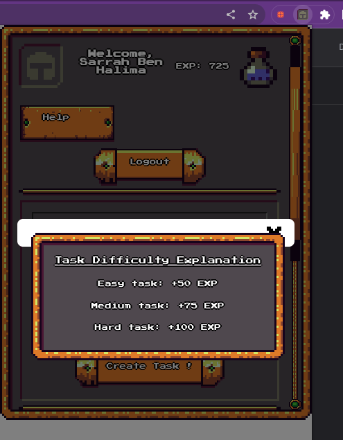

# react-django-extension

## Prerequisites

### :computer: Set up Virtual Environment

  Using **env** (preferred)

- To **create** virtual environment:
    ```Shell
    $ python3 -m venv env
    ``` 
- To **activate** virtual environment (Linux/Mac OS):
    ```Shell
    $ source env/bin/activate
    ``` 

## Setting up the Backend
### Install dependencies
Run the following command inside your virtual environment:
   ``` 
- Using **env**:
    ```Shell
    $ pip install -r requirements.txt # (Python 2)
    $ pip3 install -r requirements.txt # (Python 3)
   ```

### :atom_symbol: Test the Web Application
You can check whether everything is working by **running both React and Django concurrently** at your local development server:

```Shell
$ npm start
$ python manage.py runserver
```

## Applying tests 
- Below is a separate preview for testing:

<p align="center">  </p>


## :computer: Setting up Frontend part

- Install dependencies

```
pnpm install
```

- Start Development Server

```
pnpm dev
```

- Building the chrome extension for production

```
pnpm build
```

## :rocket: Usage

- You can find the chrome extension contents in the `dist` folder
- Open `chrome://extension` and turn on Developer Mode.
- Click the `Load unpacked extension` button.
- Now, select the `dist` folder.
- Your extension is ready to use.

## :atom_symbol: Preview of the app
- Here's a preview of different parts of the application:

<p align="center">          </p>
